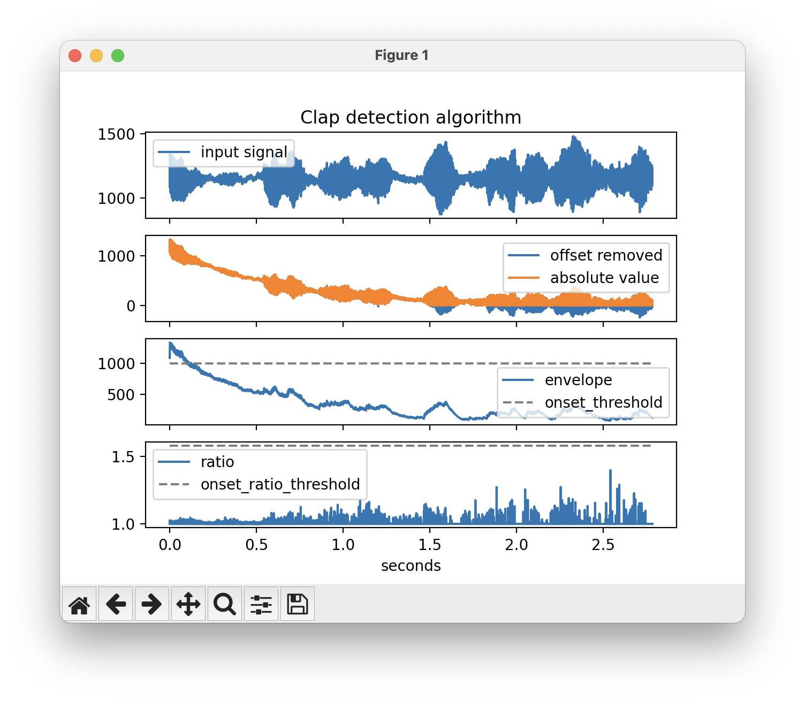
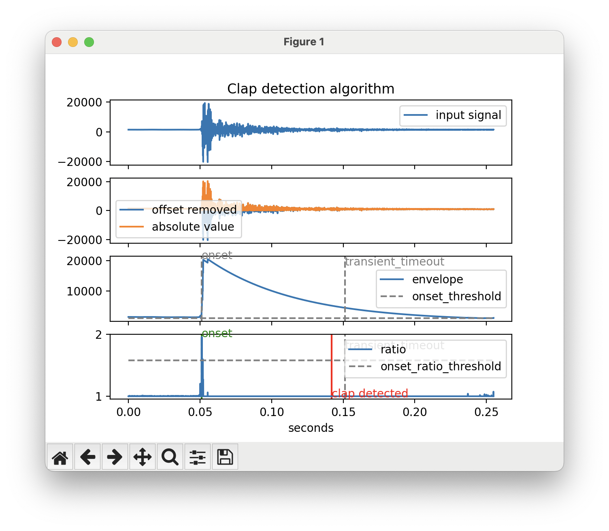

# ESPHomeClapper

ESPHomeClapper is an ESPHome component that allows you to trigger automations in Home Assistant by clapping your hands. It detects a double clap and sends an event to Home Assistant which you can use to trigger your automation.

ESPHomeClapper uses a transient detection algorithm which requires exactly two transients within a time period to fire the event. As such, it also responds to other percusive sounds as if they were claps.

## Installation

### ESPHome
Since ESPHomeClapper uses the microphone component, which is only supported on the ESP32 platform, ESPHomeClapper also only supports the ESP32 platform.

Add the following to your YAML file to make use of ESPHomeClapper. Make sure to adapt the `i2s_audio` and `microphone` sections to your board. 

```
esphome:
  min_version: 2024.7.1

esp32:
  framework:
    type: esp-idf

external_components:
  - source: github://rpoelstra/ESPHomeClapper@main
    components: [ clapper ]
  - source: github://pr#8181
    components: [ i2s_audio, microphone ]

i2s_audio:
  - i2s_lrclk_pin: GPIO33
    i2s_bclk_pin: GPIO19

microphone:
  - platform: i2s_audio
    i2s_din_pin: GPIO23
    adc_type: external
    bits_per_sample: 16bit
    pdm: true

event:
    - platform: clapper
      name: My Clapper
```

### Home Assistant

In the automation editor in Home Assistant select 'Entity' as automation trigger and then select 'State'. Select your clapper as the entity. You can leave all other fields blank. 

## Configuration variables

- **dc_offset_factor** (_Optional_): Factor that controls how fast the system will respond to changes in the DC offset of the signal. Should be very close to 1. Defaults to 0.9999. 
- **envelope_decay_factor** (_Optional_): Factor that controls how fast the system decays after a signal peak. Should be close to 1. Defaults to 0.999.
- **onset_threshold** (_Optional_): Minimum signal input required for an onset to be detected. Defaults to 1000.
- **onset_ratio_threshold** (_Optional_): Ratio between two consequtive samples that will be required for the onset to be marked as such. Defaults to 1.58.
- **transient_timeout** (_Optional_): The maximum allowed time for the transient to last to be detected as a clap. Defaults to 100 ms.
- **transient_decay_threshold_factor** (_Optional_): The minimum decay the transient such have in the timeout period to be detected as a clap. Defaults to 0.25.
- **minimum_time_window** (_Optional_): The minimum time between claps for them to be considered a grouped event. Defaults to 250 ms.
- **maximum_time_window** (_Optional_): The maximum time between claps for them to be considered a grouped event. Defaults to 500 ms.

## Full example

The following YAML is a full configuration example for the M5Stack Atom Echo:
```
esphome:
  name: clapper
  min_version: 2024.7.1

esp32:
  board: m5stack-atom
  framework:
    type: esp-idf

logger:
api:

ota:
  - platform: esphome

wifi:
  ssid: <YOUR SSID>
  password: <YOUR PASSSWORD>

external_components:
  - source: github://rpoelstra/ESPHomeClapper@main
    components: [ clapper ]
  - source: github://pr#8181
    components: [ i2s_audio, microphone ]

i2s_audio:
  - i2s_lrclk_pin: GPIO33
    i2s_bclk_pin: GPIO19

microphone:
  - platform: i2s_audio
    i2s_din_pin: GPIO23
    adc_type: external
    bits_per_sample: 16bit
    pdm: true

event:
    - platform: clapper
      name: My Clapper
```

## Tweaking the configuration variables

The configuration variables will likely need to be tweaked to get proper results for your scenario.
In order to understand how the algorithm behaves in certain conditions, you can use the Python script from the `docs` folder.
You can feed this script a recording from your ESPHome device and it will visualize where it detects claps and it will show the various thresholds which correspond to the various configuration variables.

Make sure you have to following packages installed (probably inside a `venv`):
- numpy
- matplotlib

### Obtaining a recording

You can add a small amount of code to your `microphone` configuration, which will send the received audio to an UDP server on your computer. You can then use this recording directly in the Python script.

Add the following to your microphone section. Make sure to alter the IP address to match the address of your computer. This piece of code is taken from: https://community.home-assistant.io/t/is-there-a-way-to-stream-audio-from-one-esphome-to-another/581786/15

```
microphone:
    (...)
    on_data:
      - lambda: |-
          static int sock = -1;

          if (sock < 0) {
            sock = ::socket(AF_INET, SOCK_DGRAM, 0);
            if (sock >= 0) {
              static const struct sockaddr_in destination = {
                .sin_family = AF_INET,
                .sin_port = htons(12345),
                .sin_addr = { .s_addr = inet_addr("192.168.1.219") }
              };
              if (::connect(sock, reinterpret_cast<const struct sockaddr *>(&destination), sizeof(destination)) != 0) {
                (void) ::close(sock);
                sock = -1;
              }
            }
          }

          if (sock >= 0) {
            static std::vector<int16_t> audio_buffer;

            for (const auto sample : x) {
              audio_buffer.push_back(sample);
            }
            if (audio_buffer.size() >= 256) {
              (void) ::send(sock, audio_buffer.data(), audio_buffer.size() * sizeof(int16_t), 0);
              audio_buffer.clear();
            }
          }
```

Start an UDP server on your computer using e.g. `nc -lu 12345 > test.raw` for macOS. For Linux or Windows there is probably a similar command available.

You can inspect the recording using a program like Audacity, where you can perform a raw audio import. Configure the import for a 16000 hz samplerate, mono, 16-bit.

### Analysing using the Python script

Adjust the Python script in the `doc` folder, by adjusting the filename on line 5. Also make sure that you set all configuration variables to match your yaml file. 

Running the script should result in the following plot:



The top graph shows the input waveform and the graphs below that show various stages of the algorithm. We will explain these as we discuss the configuration parameters.

#### dc_offset_factor

Notice that the input signal various from about 1000 to 1500. This indicates that there is a significant DC offset present in the sginal. The first configuration parameter controls how fast this DC offset is removed. Notice that the second graph shows a decaying waveform from 0 s to about 1.5 s. The slope of this is control by the `dc_offset_factor`, where a larger number results in lighter slope.

This second graph also shows the resulting waveform when the absolute value is taken. This is important for the next step, where the envelope is calculated.

#### envelope_decay_factor

The envelope_decay_factor controls how tight the envelope follows the absolute value waveform. This is best demonstrated using a short recording, where an individual clap can be seen:



Notice the decaying waveform shortly after the onset in the third graph. The slope of this curve is controlled by the `envelope_decay_factor` where a higher number will decrease the slope and a lower number will increase the slope making it follow the waveform better, but will also introduce more spikes in the signal.

#### onset_threshold

The `onset_threshold` is also shown in the third graph with the horizontal dashed line. The amplitude of a transient needs to be above this line for an onset to be detected.

#### onset_ratio_threshold

From the envelope curve in graph three a ratio is caluclated by dividing the 'current' envelope amplitude by the previous envelope amplitude. This results in the signal in the bottom, fourth, graph. For an onset of a transient to be detected, this ratio needs to be above `onset_ratio_threshold`, which is indicated by the horizontal dashed line.

#### transient_timeout and transient_decay_threshold_factor

When an onset is detected a vertical dashed line is plotted, marked with 'onset', as can be seen in the image in section 'envelope_decay_factor'.
A second vertical dashed line is plotted `transient_timeout` seconds later (and marked as such). The envelope must be below `transient_decay_threshold_factor` * max_envelope before the `transient_timeout` line, otherwise the transient is discarded. `max_amplitude` here is the maximum of the envelope between the 'onset' and 'transient_timeout' markers.

If a clap is accepted, a solid vertical line is drawn marked with 'clap detected'. This can also be seen in the previous plot.

#### minimum_timeout_window and maximum_timeout_window

The minimum and maximum timeout window configuration parameters are not used by the Python script, as the script only shows detection of single claps. These configuration variables are used in determining whether a series of claps constitute a double clap. The claps need to be spaced at least `minimum_timeout_window` apart and no more than `maximum_timeout_window`. There must also not be a third (or higher) transient after the second clap.
